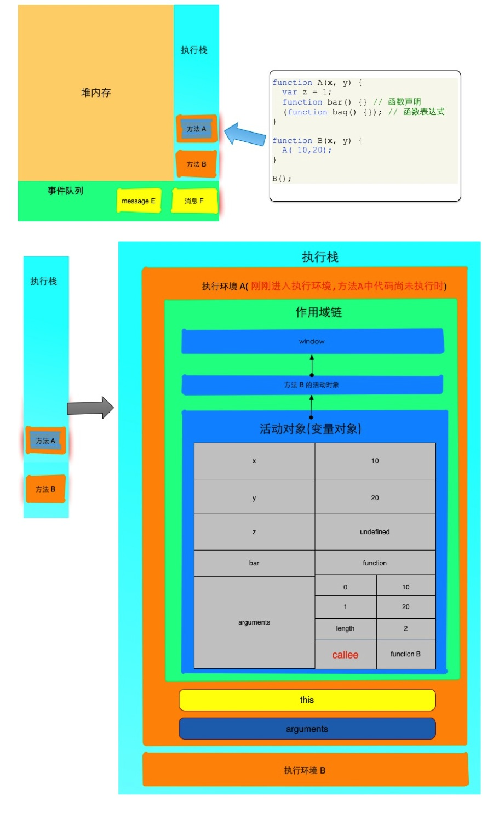
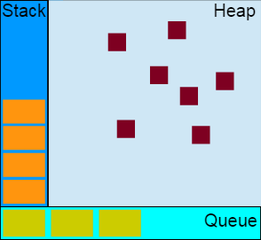

# JavaScript thread model

众所周知，JavaScript是单线程运行的

## 为什么 JavaScript 是单线程的？


单线程是相对多线程而言的，假如从来就没有过多线程这个概念，那么就不会有这个问题存在了。


那为什么会存在这个问题呢？因为 JavaScript 可以实现并发，达到类似多线程的效果但是却没有用多线程来实现。


所以引出了另外的问题：

* 为什么要用单线程而不是多线程实现呢？
* JavaScript如何用单线程实现并发？


JavaScript是以单线程的方式运行的，说到线程就自然联想到进程。


进程是应用程序的执行实例，每一个进程都是由私有的虚拟地址空间、代码、数据和其它系统资源所组成；

线程则是进程内的一个独立执行单元，在不同的线程之间是可以共享进程资源的。

在系统创建进程之后就开始启动执行进程的主线程，而进程的生命周期和这个主线程的生命周期一致，主线程的退出也就意味着进程的终止和销毁。

主线程是由系统进程所创建的，同时用户也可以自主创建其它线程，这一系列的线程都会并发地运行于同一个进程中。


显然，在多线程操作下可以实现应用的并行处理，从而以更高的CPU利用率提高整个应用程序的性能和吞吐量。

特别是现在很多语言都支持多核并行处理技术，然而JavaScript却以单线程执行。


网上很多声音都说这和它的历史有关系，其实这与它的用途有关，因为这个**用途**容易带来死锁，所以有一个更重要的原因——避免死锁。
作为浏览器脚本语言，JavaScript的主要用途是与用户互动，以及操作DOM，若以多线程的方式操作这些DOM，则可能出现操作的冲突。
假设有两个线程同时操作一个DOM元素，*线程1*要求浏览器删除DOM，而*线程2*却要求修改DOM样式，这时浏览器就无法决定采用哪个线程的操作。
当然，我们可以为浏览器引入**锁** 的机制来解决这些冲突，但这会大大提高复杂性，所以 JavaScript 从诞生开始就选择了单线程执行。


多线程的GUI框架特别容易死锁。[《Multithreaded toolkits: A failed dream?》](https://community.oracle.com/blogs/kgh/2004/10/19/multithreaded-toolkits-failed-dream)描述了其中的缘由，
大致是说GUI的行为大多都是从更抽象的顶部一层一层调用到操作系统级别，而事件则是反过来，从下向上冒泡，结果就是两个方向相反的行为在碰头，给资源加锁的时候一个正序，一个逆序，极其容易出现互相等待而饿死的情况。
AWT最初其实就是想设计成多线程的，但是使用者非常容易引起死锁和竞争，最后Swing还是做成了单线程的。
但凡这种**EventLoop+单线程**执行的模式，我们还可以找到很多，比如JDK的GUI线程模型，主线程就是一个**主事件循环**，还有Mac系统的Cocoa等等，都是这样的模式。


因为 JavaScript 是单线程的，在某一时刻内只能执行特定的一个任务，并且会阻塞其它任务执行。
那么对于**I/O**等耗时的任务，就没必要等待他们执行完后才继续后面的任务。
在这些任务完成前，JavaScript完全可以往下执行其他操作，当这些耗时的任务完成后则以回调的方式执行相应处理。


对于不可避免的耗时操作（如：繁重的运算，多重循环），HTML5提出了WebWorker，它会在当前JavaScript的执行主线程中利用Worker开辟一个额外的线程来加载和运行特定的JavaScript脚本。
这个新的线程和JavaScript的主线程之间并不会互相影响和阻塞执行，而且在WebWorker中提供了这个新线程和JavaScript主线程之间数据交换的接口：`postMessage`和`onMessage`事件。
但WebWorker不能操作DOM的，任何需要操作DOM的任务都需要委托给JavaScript主线程来执行，所以虽然HTML5引入WebWorker，但是他受限的。（并没有改线JavaScript单线程的本质？）


事实上，JavaScript语法核心没有描述任何线程机制，大部分语言都没有在语言层面直接定义线程的。
线程都是作为核心库或者第三方库提供给开发者调用，所以也并不是因为javascript无法实现多线程。
如Node.js就有可以支持线程的库，HTML5也引入了WebWorker。


上面解释了JavaScript为什么要以单线的方式运行，既然JavaScript是单线程的，那么JavaScript是如何实现并发的？


## JavaScript如何用单线程实现并发？


JavaScript有个基于 **EventLoop** 的 **并发模型**，能把单线程的 JavaScript 使出 **多线程** 的 感觉。


*并发(Concurency)*和*并行(Parallelism)*：

* 并行是指：一组程序按独立异步的速度执行，不等于时间上的重叠（同一个*时刻*发生)。
* 并发是指：在同一个*时间段*内，两个或多个程序执行，有时间上的重叠（宏观上是同时，微观上仍是顺序执行）。


[通信中的并行串行](https://zh.wikipedia.org/wiki/%E4%B8%B2%E8%A1%8C%E9%80%9A%E4%BF%A1)

并行也指8位数据同时通过并行线进行传送，与之相对的是串行，这样数据传送速度大大提高，但并行传送的线路长度受到限制，因为长度增加，干扰就会增加，数据也就容易出错。


前者是逻辑上的同时发生，而后者是物理上的同时发生。所以，单核处理器也能实现并发。

并发和并行的区别就是 *一个处理器同时处理多个任务* 和 *多个处理器或者是多核的处理器同时处理多个不同的任务*。


一个错误的结论：**javascript是不存在并发的，并发只是看起来像并发而已**。


如上图的第一个表，由于计算机系统只有一个CPU，故ABC三个程序从“微观”上是交替使用CPU，但交替时间很短，用户察觉不到，形成了“宏观”意义上的并发操作。


这种 **并发模型** 通常称为**asynchronous**或**non-blocking**模型


## Event_loop

[Event_loop](https://en.wikipedia.org/wiki/Event_loop)

In computer science, the event loop, message dispatcher, message loop, message pump, or run loop is a programming construct that waits for and dispatches events or messages in a program. 


之所以被称为EventLoop，因为它用类似以下方式实现：

```js
// other code
function eventloop() {
  while(eventHandler = waitForEvents()){
    eventHandler.processEvent();
  }
  sleep(); // 睡一下
  eventloop();
}
eventloop();
```


从图中来看，EventLoop好像并不是V8引擎的一部分，如果真是这样的话，那么在EventLoop应该是Node.js或Browser实现的，不过这不影响理解。


EventLoop绝不能阻塞，这个位置阻不阻塞不是JavaScript代码能决定的。保证当应用等待异步请求返回时，其仍能处理其它操作。


## 任务队列








图中：

* Stack 这里放着JavaScript正在执行的任务，每个任务被称为帧（frame）。
* Heap 一个用来表示内存中一大片非结构化区域的名字，对象都被分配在这。
* TasksQueue 一个 JavaScript Runtime 包含了一个任务队列，该队列是由一系列待处理的任务（包含事件处理函数）组成。


每个任务都有相对应的函数，当栈为空时，就会从任务队列中取出一个任务，然后进行处理。
该处理会调用与该任务相关联的一系列函数（因此会创建一个初始栈帧），当该任务处理完毕后，栈就会再次为空。


如果I/O设备完成任务或用户触发事件，那么相关事件处理函数就会进入“任务队列”，当主线程处理完上一个任务时，就会调度“任务队列”里第一个待处理任务。
当然，对于定时器，当到达其指定时间时，才会把相应任务插到“任务队列”尾部。


任务不能被中断。

每当某个任务执行完后，其它任务才会被执行。也就是说，当一个函数运行时，它不能被取代且会在其它代码运行前先完成。不会像多线程那样，多个任务交替执行。
当然，这也带来一个缺点：当一个任务完成时间过长，那么应用就不能及时处理用户的交互（如点击事件），甚至导致该应用奔溃。
这与操作系统的进程调度模式有根本的不同，操作系统不能允许一个进程长时间占有CPU，以保证其他程序能够有机会得到执行。
一个比较好解决方案是：将任务完成时间缩短，或者尽可能将一个任务分成多个任务执行，但是这需要开发人员来保证。


### 只有EventLoop是不够的


通过上面对EventLoop的介绍，已经了解了JavaScript是如何实现并发的，但是只有EventLoop是不够的。那就是任务队列中的方法是哪里来的？


其实我们已经知道答案，那就是异步函数。异步函数的回掉函数在异步函数执行完成之后，被放入了任务队列。同步函数是没有这个能力的，因为没这个需要。


### 异步和回掉


回掉可以看作是一种协议，用来进行消息通知，Node.js的事件驱动同样也是用来消息通知，但同样也是由回掉函数来处理，Promise也是基于回掉的。


回掉和异步不是一定要连在一起。下面这段代码，有回掉函数，但是依然是同步的。

```js
function sort(compare) {
  return compare(l, r);
}
```

@see
[回调函数](https://zh.wikipedia.org/wiki/%E5%9B%9E%E8%B0%83%E5%87%BD%E6%95%B0)
[回调函数是什么？](https://www.zhihu.com/question/19801131)


### 事件轮询和异步回掉带来的效果


> 改变了代码的执行顺，代码的执行顺序不再是按照代码的前后关系逐句执行。


代码一段一段入栈（ECS）执行，因为栈的一个单元（EC）可以看作是一个函数，所以这里一段代码就当作一个函数来理解。


当这些最外层的函数执行完之后是不是程序就没事干了？

肯定不是。怎么可能让CPU闲着，并且还有很多事情做，只是这些事情还没说开始。


#### 那这个时候 JS 该做什么？

大家都知道，当最外层的代码执行过之后，JS在等待一些事件发生，然后对这些事件进行相应的处理。那么该做的就是等待事件发生。


#### 正在做什么？

最外层的代码做的工作可以看作是初始化工作，加载各个模块，初始化数据库连接、创建目录、注册各种事件处理函数、发起请求、监听网络等，即向系统交代我们的期待。

最外层代码执行完之后（实际上就是那么一瞬间完成），那他现在应该做的就是：等待关注的事情发生，使用的方式就是轮询任务队列。

这些事件可能持续不断的产生，甚至是同时产生，这些事件的处理函数放到任务队列当中，等待JS引擎处理。


JS在这里充当了任务的生产者，任务结果的消费者。

这样可行的前提是：生产任务和回掉处理函数执行的时间相比之下非常短，而实际任务的执行时间相比之下非常长，即IO操作远远慢于CPU操作，CPU可以同时和好多个IO一起玩。


#### 整体流程：

1. JS引擎开始执行全局环境下的代码，创建全局执行环境并入栈，然后开始*事件循环*。
1. JS引擎读取堆栈信息，这种方式下，第一次栈一定不为空。
    1. 如果有任务需要处理，将任务相关处理函数推入执行环境栈中。处理任务的过程可能还是向系统交代其他工作。下一个待处理的任务什么时候处理取决于这个任务什么时候处理完成。
    1. 如果没有任务需要处理，JS引擎过一会儿再来看看。


所以，异步函数带来的效果就是，代码执行的时机是不确定的，它取决于异步函数什么时候完成，在还取决于在任务队列中的位置，先进先出。
执行时机不再是代码的静态位置决定，但是闭包却又是静态作用域决定的。这两点结合在一起构成一个强大的模型。


通过上面的分析可以看到，JS的执行过程实际上类似于树的遍历，但是既不是广度的也不是深度的，是时间优先的，谁先有机会执行就谁先。
而且这颗树在持续不断生长，甚至没有边界，直到进程退出。遍历过的部分正常情况都会被回收，静态的代码是有限的，动态的活动对象是无限的。

#### process.nextTicket vs setTimeout

`process.nextTicket`，给开发者 直接向 高优先级任务队列 中添加 任务 的能力，`setTimeout(() => {}, 0)`也可以向 任务队列 中添加 任务，但是却是 间接 的。

https://www.quora.com/What-does-process-nextTick-callback-actually-do-in-Node-js


## 小结


单线程指的是我们编写的JavaScript代码是运行在一个线程当中，而JavaScript引擎进行的是并发调度。


从我们的角度，JavaScript确实是并发的，因为JS同时可以处理很多任务，但是实际上这些任务并不是JavaScript引擎处理的，而是由运行环境的扩展（如setTimeout）来实现的。


这些扩展作为JavaScript的一部分，在调用的时候肯定是JS线程在执行，扩展程序在执行时可以创建其他线程来工作，JS线程将不会阻塞继续处理其他任务，而这个新线程在任务处理完成之后，会将回掉函数插入到JS的任务队列中。


如果扩展代码是同步的，如Node.jsApi的fs部分的同步函数，那么JS执行线程将被阻塞。

如果JS的代码同步运行时间太久，同样会阻塞异步任务处理。


JavaScript只是把任务交代出去，对任务的结果进行处理，处理的函数已经通过回掉的方式写好了，处理函数可以继续安排新的异步任务。


单线程：指的是JavaScript代码是在同一个线程中运行。任何一段JavaScript代码阻塞了执行流，那么程序将会卡在这里。

任务队列：上面说有有一个线程负责与其他线程交互，其实可以没有，JS扩展作为运行环境的一部分，具有与JS引擎交互的能力，如异步完成之后，将任务处理程序放入任务队列。


几个线程？其他线程做什么？

  JS代码肯定执行在一个线程中这是毋庸置疑的。通过上面的描述也无须另一个线程。所以有些博客中说有一个EventLoop线程，我觉的是没必要的。
  其他线程是在js调用异步函数是产生的，但不是一定需要创建新的线程。如Node中监听文件描述符只用一个线程就够了，如果这个线程已经存在就无须再创建。


TasksQueue中的队列是谁放进来的？是否有一个维护队列的线程？

  异步函数是JS引擎的在运行环境中的扩展。


## Node.js & Browser

浏览器不是单线程的，它们在内核制控下相互配合以保持同步，一个浏览器至少实现三个常驻线程：

* javascript引擎线程
  javascript引擎是基于事件驱动单线程执行的，JS引擎一直等待着任务队列中任务的到来，然后加以处理，浏览器无论什么时候都只有一个JS线程在运行JS程序。

* GUI渲染线程
  GUI渲染线程负责渲染浏览器界面，当界面需要重绘（Repaint）或由于某种操作引发回流(reflow)时,该线程就会执行。但需要注意GUI渲染线程与JS引擎是互斥的，当JS引擎执行时GUI线程会被挂起，GUI更新会被保存在一个队列中等到JS引擎空闲时立即被执行。

* 浏览器事件触发线程
  事件触发线程，当一个事件被触发时该线程会把事件添加到“任务队列”的队尾，等待JS引擎的处理。
  这些事件可来自JavaScript引擎当前执行的代码块如setTimeOut、也可来自浏览器内核的其他线程如鼠标点击、AJAX异步请求等，但由于JS是单线程执行的，所有这些事件都得排队等待JS引擎处理。
  在Chrome浏览器中，为了防止因一个标签页奔溃而影响整个浏览器，其每个标签页都是一个进程。当然，对于同一域名下的标签页是能够相互通讯的，具体可看 浏览器跨标签通讯。在Chrome设计中存在很多的进程，并利用进程间通讯来完成它们之间的同步，因此这也是Chrome快速的法宝之一。
  对于Ajax的请求也需要特殊线程来执行，当需要发送一个Ajax请求时，浏览器会开辟一个新的线程来执行HTTP的请求，它并不会阻塞JavaScript线程的执行，当HTTP请求状态变更时，相应事件会被作为回调放入到“任务队列”中等待被执行。


## Timer


### How JavaScript Timers Work？


从基础的层面来讲，理解JavaScript的定时器是如何工作的是非常重要的。
计时器的执行常常和我们的直观想象不同，那是因为JavaScript引擎是单线程的。
我们先来认识一下下面三个函数是如何控制计时器的。


* `var id = setTimeout(fn, delay);`       - 初始化一个计时器，然后在指定的时间间隔后执行。该函数返回一个唯一的标志ID（Number类型），我们可以使用它来取消计时器。
* `var id = setInterval(fn, delay);`      - 和setTimeout有些类似，但它是连续调用一个函数（时间间隔是delay参数）直到它被取消。
* `clearInterval(id);, clearTimeout(id);` - 使用计时器ID（setTimeout 和 setInterval的返回值）来取消计时器回调的发生


为了理解计时器的内在执行原理，有一个重要的概念需要加以探讨：计时器的延迟(delay)是无法得到保障的。
由于所有JavaScript代码是在一个线程里执行的，所有异步事件（例如，鼠标点击和计时器）只有拥有执行机会时才会执行。


用一个很好的图表加以说明：


在这个图表中有许多信息需要理解，如果完全理解了它们，你会对JavaScript引擎如何实现异步事件有一个很好的认识。

这是一个一维的图标：垂直方向表示时间，蓝色的区块表示JavaScript代码执行块。例如第一个JavaScript代码执行块需要大约18ms，鼠标点击所触发的代码执行块需要11ms，等等。


由于JavaScript引擎同一时间只执行一条代码，所以每一个JavaScript代码执行块会“阻塞”其它异步事件的执行。
这就意味着当一个异步事件发生（例如，鼠标点击，计时器被触发，或者Ajax异步请求）后，这些事件的回调函数将排在执行队列的最后等待执行；


从第一个JavaScript执行块开始研究，在第一个执行块中两个计时器被初始化：一个10ms的setTimeout()和一个10ms的setInterval()。
依据何时何地计时器被初始化(计时器初始化完毕后就会开始计时)，计时器实际上会在第一个代码块执行完毕前被触发。
但是，计时器上绑定的函数不会立即执行，实际上，被延迟的函数将依次排在执行队列的最后，等待下一次恰当的时间再执行。


此外，在第一个JavaScript执行块中我们看到了一个“鼠标点击”事件发生了。
一个JavaScript回调函数绑定在这个异步事件上了（我们从来不知道用户什么时候执行这个（点击）事件，因此认为它是异步的），这个函数不会被立即执行，和上面的计时器一样，它将排在执行队列的最后，等待下一次恰当的时候执行。


当第一个JavaScript执行块执行完毕后，浏览器会立即问一个问题：哪个函数（语句）在等待被执行？
在这时，一个“鼠标点击事件处理函数”和一个“计时器回调函数”都在等待执行。
浏览器会选择一个（实际上选择了“鼠标点击事件的处理函数”，因为由图可知它是先进队的）立即执行。
而“计时器回调函数”将等待下次适合的时间执行。
显然，引擎在处理完一个任务之后，会查看任务队列，如果队列中无任务，则会等下一轮轮询。


注意，当“鼠标点击事件处理函数”执行的时候，setInterval的回调函数第一次被触发了。
和setTimeout的回调函数一样，它将排到执行队列的最后等待执行。
但是，一定要注意这一点：当setInterval回调函数第二次被触发时（此时setTimeout函数仍在执行）setTimeout的第一次触发将被抛弃掉。
当一个很长的代码块在执行时，可能把所有的setInterval回调函数都排在执行队列的后面，代码块执行完之后，结果便会是一大串的setInterval回调函数等待执行，并且这些函数之间没有间隔，直到全部完成。
所以，浏览器倾向于的当没有更多interval的处理函数在排队时再将下一个处理函数排到队尾(这是由于间隔的问题)。


我们能够发现，当第三个setInterval回调函数被触发时，之前的setInterval回调函数仍在执行。
这就说明了一个很重要的事实：setInterval不会考虑当前正在执行什么，而把所有的堵塞的函数排到队列尾部。
这意味着两次setInterval回调函数之间的时间间隔会被牺牲掉（缩减）。


最后，当第二个setInterval回调函数执行完毕后，我们可以看到没有任何程序等待JavaScript引擎执行了。
这就意味着浏览器现在在等待一个新的异步事件的发生。
在50ms时一个新的setInterval回调函数再次被触发，这时，没有任何的执行块阻塞它的执行了。所以它会立刻被执行。


让我们用一个例子来阐明setTimeout和setInterval之间的区别：

```js
  setTimeout(function(){
    /* Some long block of code... */
    setTimeout(arguments.callee, 10);
  }, 10);

  setInterval(function(){
    /* Some long block of code... */
  }, 10);
```

这两句代码乍一看没什么差别，但是它们是不同的。setTimeout回调函数的执行和上一次执行之间的间隔至少有10ms，而setInterval的回调函数将尝试每隔10ms执行一次，不论上次是否执行完毕。


总结一下：

JavaScript引擎是单线程的，强制所有的异步事件排队等待执行
setTimeout 和 setInterval 在执行异步代码的时候有着根本的不同
如果一个计时器被阻塞而不能立即执行，它将延迟执行直到下一次可能执行的时间点才被执行（比期望的时间间隔要长些）
如果setInterval回调函数的执行时间将足够长（比指定的时间间隔长），它们将连续执行并且彼此之间没有时间间隔。
上述这些知识点都是非常重要的。了解了JavaScript引擎是如何工作的，尤其是大量的异步事件（连续）发生时，才能为构建高级应用程序打好基础。


### 零延迟 `setTimeout(func, 0)`

零延迟并不是意味着回调函数立刻执行，它取决于主线程当前是否空闲与“任务队列”里其前面正在等待的任务。


用途：改变执行顺序

```js
(function () {
  console.log('this is the start');
  setTimeout(function cb() {
    console.log('this is a msg from call back');
  });
  console.log('this is just a message');
  setTimeout(function cb1() {
    console.log('this is a msg from call back1');
  }, 0);
  console.log('this is the  end');
})();
// 输出如下：
// this is the start
// this is just a message
// this is the end
// undefined // 立即调用函数的返回值
// this is a msg from callback
// this is a msg from a callback1
```


### 用 setTimeout 模仿 setInterval

```js
function setIntervalSimulation(cb, m) {
  setTimeout(function(){
    cb();
    setTimeout(cb, m);
  }, m);
}

setIntervalSimulation(function(){
}, 1000);

setInterval(function(){
}, 1000);
```

上面案例中的 `setIntervalSimulation` 总是会在其回调函数执行后延迟 1000ms（至少）再次执行回调函数，从而 模拟 `setInterval` 的效果，
而 `setInterval` 总是 1000ms 执行一次，而不管它的回调函数执行多久。


所以，如果 `setInterval` 的回调函数执行时间比你指定的间隔时间相等或者更长，那么其回调函数会连在一起执行。


请看代码：

```js
var counter = 1;
var initTime = new Date().getTime();
var timer = setIntervalSimulation(function () {
  if (counter === 3) {
    clearInterval(timer);
  }
  if (counter === 1) {
    for (var i = 0; i < 1990000000; i++) {
      // 此循环大约需要 2374 ms > 1000 ms
    }
  }
  console.log("第" + counter++ + "次：" + (new Date().getTime() - initTime) + " ms");
}, 1000);

// Chrome的输入如下：
// 第1次：2007 ms
// 第2次：2013 ms
// 第3次：3008 ms
//
// Node.js的输入如下：
// 第1次：2331 ms
// 第2次：4664 ms
// 第3次：5668 ms

```


可见，Node.js的`setInterval`是用`setTimeout`模拟实现的。


### 拆分耗时逻辑


很多时候我们需要把耗时的逻辑拆分，腾出时间来给其他逻辑的执行。
下面的代码源自《Timed array processing in JavaScript》这篇文章，作者首先给出一个这样的拆分逻辑执行的框架代码：

```js
function chunk(array, process, context){
    var items = array.concat();
    setTimeout(function(){
        var item = items.shift();
        process.call(context, item);
        if (items.length > 0){
            setTimeout(arguments.callee, 100);
        }
    }, 100);
}
```


但他同时也马上指出了其中的问题，100毫秒的间隔延时太长了，也许25毫秒就够了，但是不能为0，0也可以使得这个执行拆分成多个事件进入队列，但是我们需要给UI的更新渲染等等留一些时间。于是他又改进了一下：

```js
// Copyright 2009 Nicholas C. Zakas. All rights reserved.
// MIT Licensed
function timedChunk(items, process, context, callback){
    var todo = items.concat();
    setTimeout(function(){
        var start = +new Date();
        do {
             process.call(context, todo.shift());
        } while (todo.length > 0 && (+new Date() - start < 50));

        if (todo.length > 0){
            setTimeout(arguments.callee, 25);
        } else {
            callback(items);
        }
    }, 25);
}
```


可以看见，这可以更充分地利用时间，执行的任务放到一个数组中，只要每次chunk内执行的时间不足50毫秒，就继续执行；一旦超过50毫秒，就留给外部事件25毫秒去处理。

